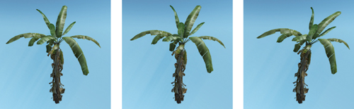

---

layout:     post

title:      "Vegetation Procedural Animation and Shading in Crysis"

subtitle:   "“孤岛危机”中的植被程序动画与阴影"

date:       2020-10-10 12:00:00

author:     "Wanghan"

header-img: "img/kuiba01-2017-10-29.jpg"

tags:

    - 场景

---
# “孤岛危机”中的植被程序动画与阴影
*Tiago Sousa*
*Crytek*
在Crytek（游戏开发商），Crysis（孤岛危机）的主要目标之一是为计算机游戏图形定义新标准。 为这款最新的游戏，我们开发了一些新技术，它们共同构成了CryENGINE 2。在这些新技术中，植被渲染是非常关键的一环。它由几个部分组成，包括程序破坏和物理交互，阴影，程序动画和ditant sprite generation等。
游戏中的植被一直是静态的，带有某种简单的弯曲可以产生风的幻觉。我们的游戏场景可以有数千种不同的植被，但我们仍然通过使植被对全局和局部风源作出反应来进一步推动这一局限，我们不仅弯曲植被而且还弯曲叶子，所有程序化的计算都在GPU上高效地完成。
在本章节中，我们介绍了如何以高效和接近真实的方式处理shadering和程序植被动画。
## 16.1 程序化动画
在我们的方法中，我们将动画分为两部分：

1.  主弯曲，沿着风向摆动整个植被;
2.  细节弯曲，使叶子动起来。

通过叠加所有影响物体的风力总和，计算在世界空间中计算每个物体处的风向量。风区域可以是单一方向或全向风源。在我们的例子中，我们计算这个总和的方法与影响单个点的光源叠加的方法非常类似，同时考虑方向和衰减。此外，每个物体都有自己的刚度，当物体停止受到任何风源的影响时，风力会随着时间的推移而受到抑制。 图16-1显示了一个示例。\

**Figure 16-1 主弯曲强度逐渐加大**\
设计人员可以将风源放置在特定位置，将它们连接到实体（例如直升机），然后连接到粒子系统。 通过这种方法，我们理论上可以提供大量的风源，同时保持每顶点成本不变，尽管每增加物体会线性增加一些额外CPU成本。\
我们使用风向量的xy分量生成主弯曲，它给出了风向和强度，使用植被mesh高度作为应用顶点变形的scale值。 注意，必须注意限制变形强度; 否则，结果看起来不真实。\
对于叶子的细节弯曲，我们以类似的方式处理事物，但在这种情况下，仅考虑风力。艺术家使用常见的3D建模软件为每个顶点绘制一种RGB颜色。这种颜色为我们提供了有关细节弯曲的额外信息。 如图16-2所示，红色通道用于叶片边缘的刚度，绿色通道用于叶片的相位变化，蓝色通道调整叶片整体刚度。 alpha通道用于预先计算的环境遮挡。有关此着色的更多详细信息，请参见第16.2节。
![[file-20250315151633487.png]]
**Figure 16-2 顶点颜色**
### 16.1.1 实现细节
我们的主要目标之一是实现一个直观的系统，尽可能简单地让艺术家或设计师使用。因此，设计师的主要调整工作是风向和速度。如果在特定情况下需要，艺术家仍然可以覆盖默认设置，叶子的风速（频率），边缘和每叶片摆动幅度，以使植被动画视觉上更加舒适。
**近似正弦波**
程序化顶点动画的传统方法依赖于使用正弦波。我们可以通过使用三角波以更便宜的方式估计类似的结果。 \[1]更具体地说，对于我们的细节弯曲情况，我们总共使用四个矢量化三角波：两个用于叶子的边缘摆动，两个用于枝叶的弯曲。 计算这些波后，我们使用三次插值（Bourke 1999）对它们进行平滑处理，代码如16-1所示。 图16-3说明了该过程。
![[file-20250315151749950.png]]
```hlsl
float4 SmoothCurve( float4 x ) {
  return x * x *( 3.0 - 2.0 * x );
}
float4 TriangleWave( float4 x ) {
  return abs( frac( x + 0.5 ) * 2.0 - 1.0 );
}
float4 SmoothTriangleWave( float4 x ) {
  return SmoothCurve( TriangleWave( x ) );
}
```
**细节弯曲**
正如我们所提到的，叶子的弯曲是通过使边缘变形来完成的，使用顶点颜色的红色通道来控制边缘刚度控制。 这种变形根据世界空间顶点法线xy方向完成。
最后，我们进行了枝叶整体的弯曲，我们通过沿着z轴上下变形，使用蓝色通道进行叶片刚度来控制。\
顶点颜色的绿色通道包含每个枝叶相位变化，以便每个叶子以不同的方式摆动。代码16-2显示了我们的细节弯曲方法的代码。\
叶子的形状和顶点的数量可以根据植被类型而变化。例如，我们为棕榈树建模整个叶片，这使我们能够以一种非常可控的方式对其进行很好的动画制作。然而，对于更大的树木，我们将叶子模拟为几个平面; 我们想要完全控制是不可能的，因为几个叶子是用一张贴图一起绘制放在一个低面面片上的。 尽管如此，我们对所有不同情况使用相同的方法并获得了较好的结果。
**主干弯曲**
我们通过沿着风向移动顶点的xy位置来完成主干弯曲，使用标准化高度来缩放弯曲值。执行简单的位移是不够的，因为我们需要限制顶点移动来最小化偏移影子。我们通过计算顶点到网格中心的距离并使用该距离来重新缩放新的位移标准化位置来实现这一点。\
这个过程会导致植被在球形内做有限运动，这对于我们的植被案例来说足够了，因为它是一个单一的植被物体。 弯曲变形的值也需要仔细调整：过多的弯曲会不真实。代码16-3展示了我们的实现。 图16-4显示了使用这种主干弯曲技术生成的一些示例。
![[file-20250315152829687.png]]
**Figure 16-4 不同植被的弯曲**

**Example 16-2. 细节弯曲的实现**
```hlsl
// Phases (object, vertex, branch)
       float fObjPhase = dot(worldPos.xyz, 1);
    fBranchPhase += fObjPhase;
    float fVtxPhase = dot(vPos.xyz, fDetailPhase + fBranchPhase);
    // x is used for edges; y is used for branches
       float2 vWavesIn = fTime + float2(fVtxPhase, fBranchPhase );
    // 1.975, 0.793, 0.375, 0.193 are good frequencies
       float4 vWaves = (frac( vWavesIn.xxyy *
                           float4(1.975, 0.793, 0.375, 0.193) ) *
                           2.0 - 1.0 ) * fSpeed * fDetailFreq;
    vWaves = SmoothTriangleWave( vWaves );
    float2 vWavesSum = vWaves.xz + vWaves.yw;
    // Edge (xy) and branch bending (z)
    vPos.xyz += vWavesSum.xxy * float3(fEdgeAtten * fDetailAmp *
                                vNormal.xy, fBranchAtten * fBranchAmp);
```
## 16.2 植被绘制
我们在“孤岛危机”中有成千上万种不同的植物物体，通常覆盖整个屏幕。 所以我们需要牢记质量/效率比。\
出于这个原因，我们将每像素着色与顶点着色相结合，草也一样。唯一的区别是，由于草的高填充率，我们做了所有阴影变形。\
使用标准Lambert和Phong着色模型处理树干着色。\
叶子是类似的方式，但有不同。 我们将其渲染为双面，并使用alpha测试，而草使用alpha混合。 我们在项目开始时尝试了不同的方法，例如用alpha测试/混合两个pass，但对于我们的情况，性价比不高。\
实际上，树叶可以具有不同的厚度（对于我们的树叶，这是我们总是做出的假设）并且允许可变量的光在不同区域中穿过。 因此，我们需要一个次表面散射近似。\
我们使用艺术家制作的次表面纹理贴图来近似这个表现，如图16-5所示，它是使用常规图像编辑软件包创建的。 这张贴图有内部深度叶子的细节信息，例如静脉和内部分支，并且它可以是相对较低的分辨率（例如，128 x 128），具体取决于所需的细节程度。第16.2.4节中的代码16-4提供了实现细节。
![[file-20250315152841656.png]]
**Figure 16-5 次表面散射贴图示例**
因为植被的性能和质量至关重要，对于这种情况，我们决定使用廉价且艺术家友好的次表面散射近似，每个顶点计算，简单地使用 -  N·L乘以光位置可见性，E·L（ 眼睛矢量与光矢量点积），两者都乘以次表面纹理的厚度变化。 图16-6显示了一些示例。
![[file-20250315152934491.png]]
**Figure 16-6 次表面散射近似可视化**
### 16.2.1 环境光
传统的固定环境色看起来很无聊，已经过时了。 在开发之初，我们有两个不同的植被着色器。 最后一个是我们在本章中描述的实现;另一个更复杂，使用球面谐波进行间接照明，主要用于大树。 为了减少着色器==排列==的数量以及由于球谐函数的复杂性，我们不幸地不得不采用后一种方法来支撑统一且更便宜的室外环境照明解决方案。\
我们引擎的环境照明现在有三种：室外，室内和低规格硬件的简单解决方案。我们处理室内和室外环境照明的方式非常复杂，需要再解释两章; 因此，它超出了本章的范围。\
这三种都试图给光照不到的表面提供一个好的表现，在本章中，我们将假设低规格的硬件解决方案，它使用半球照明（Taylor 2001）实现，以打破阴影区域的平淡简单的表现。\
最后，我们还使用存储在顶点alpha通道中的预先计算的环境遮挡，该通道由艺术家绘制或使用标准3D建模软件计算。
### 16.2.2 边缘平滑
使用alpha测试时的一个大问题是硬边缘。在我们开发植被主要阴影的时候，任何硬件都没有alpha-to-coverage支持（我们现在也支持它）。因此，我们提出了一种特殊的解决方案，通过后处理来平滑边缘。\
在CryENGINE 2中，我们使用延迟渲染方法，首先渲染z-pass并将深度写入浮点纹理。\
这种技术可以实现很多需要深度信息的效果（Wenzel 2007）。 边缘平滑就是其中之一; 它的工作原理是使用深度纹理进行边缘检测，然后使用旋转三角形样本使用双线性滤波进行相关纹理查找。 但是，边缘平滑仅适用于不透明几何体，因为透明几何体不会将深度写入z-pass。 图16-7显示了有效的边缘平滑效果。
![[file-20250315153208680.png]]
**Figure 16-7 边缘平滑**

### 16.2.3 最终效果
最终结果是在高质量阴影和exponential tone mapper（指数色调映射）以及各种后处理方法（如bloom（Kawase 2004）和sun shafts（阳光射线特效）等）的帮助下实现的。 结合这些技术，我们实现了我们想要的最终游戏内的图像质量，如图16-8所示。
![[file-20250315153224236.png]]
**Figure 16-8 最终效果**
### 16.2.4 实现细节

在展示着色器实现之前，我们要提出我们为CryENGINE 2开发的一个统一的着色器库解决方案，它不仅简化了着色器，而且使它们更易读，更易于维护。 它还增加了强制命名约定和最小化代码重复的优秀功能。\
这个方案初衷只是为了便于协同工作并尽量减少用户与着色内核的交互。因此，所有灯光管理，环境计算和其他重要计算（例如视差遮挡映射或贴花）都隐藏在着色器编写器中。\
用户可以访问四个自定义函数，这些函数允许他们初始化自定义数据，执行per-light计算，环境光照和最终着色。 其他所有内容都作为黑盒子处理，通过统一的数据结构为用户提供四个功能中的每一个的重要数据。此数据结构包含重要的可共享数据，例如view dir，normal，diffuse map color，bump map color，alpha等。\
代码16-4和16-5显示了最终的着色器实现。代码16-5中的函数是用户自定义函数，我们在其中执行per-light source shading并应用light diffuse和specular color等光照属性。环境功能是我们进行半球照明近似的地方。 在代码的最后，材质属性（如diffuse texture，diffuse color和pecular color）应用在着色计算最终合成的地方（==类似shrface shader==）。
